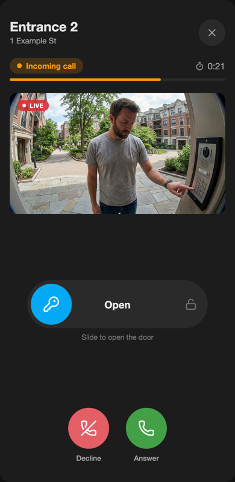
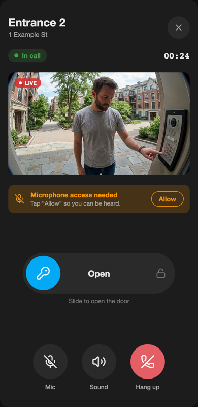
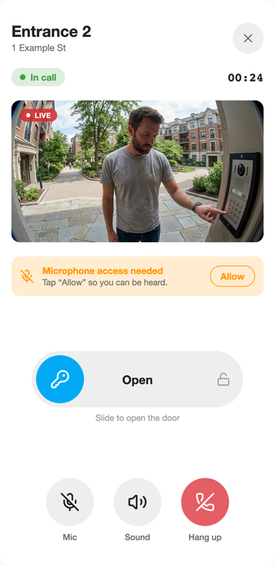
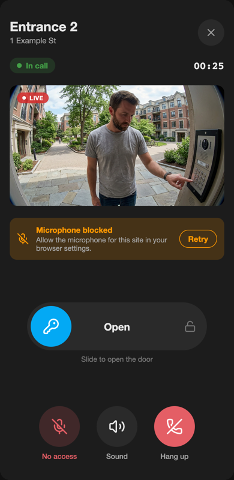
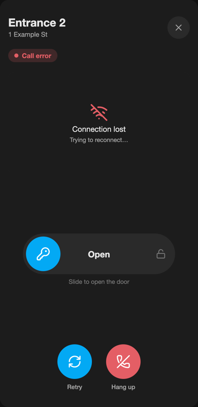
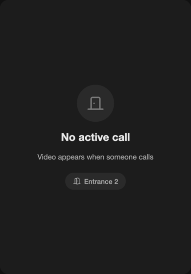
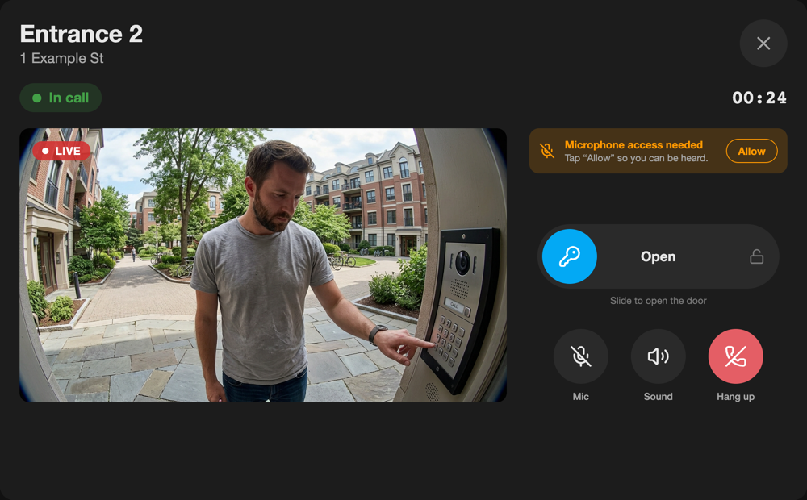
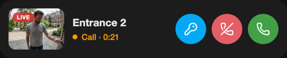
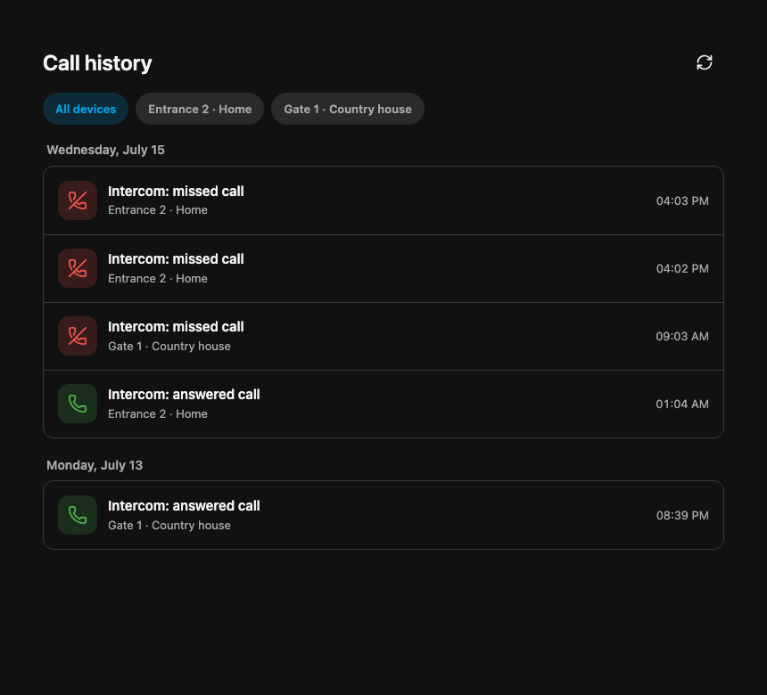

[English](/README.en_EN.md) | [Русский](/README.md)

<p>
  <a href="https://hacs.xyz"></a>
  
  
  
  
  
  
  
  
  <a href="https://boosty.to/gentslava"></a>
  <a href="https://yoomoney.ru/to/410011558436973"></a>
</p>

# Home Assistant Elektronny Gorod & Dom.ru Integration

<table>
  <tr>
    <td align="center">
      <a href="https://2090000.ru/domofony/"></a>
    </td>
    <td align="center">
      <a href="https://play.google.com/store/apps/details?id=ru.inetra.intercom"></a>
    </td>
  </tr>
  <tr>
    <td align="center">
      <a href="https://dom.ru/domofon"></a>
    </td>
    <td align="center">
      <a href="https://play.google.com/store/apps/details?id=com.ertelecom.smarthome"></a>
    </td>
  </tr>
</table>

This is a custom integration for Home Assistant that allows you to integrate with the Elektronny Gorod (Novotelecom) and Dom.ru services. It implements the APIs of the My Home – Elektronny Gorod and Umnyy Dom.ru applications.

Add your **intercoms, cameras and locks** to Home Assistant: watch video and
hear audio, open doors, answer calls, talk to visitors and browse answered and
missed call history.

> ✨ **Coming in 4.0.0:** a complete call screen, SIP answering, two-way audio,
> FCM events and call history.
> See the [overview below](#whats-new-in-400) or read the full
> [release notes](docs/releases/4.0.0.md).

## Contents

- [Installation](#installation)
- [Configuration](#configuration)
- [What's new in 4.0.0](#whats-new-in-400)
- [Features](#features)
- [Camera connection via go2rtc](#camera-connection-via-go2rtc)
- [🔔 Doorbell call event (FCM push)](#-doorbell-call-event-fcm-push)
- [📞 Call screen and two-way audio](#-call-screen-card)
- [🕘 Event history](#-event-history)
- [Automation example: balance](#automation-example-balance)
- [Issues and Contributions](#issues-and-contributions)
- [License](#license)

## What's new in 4.0.0

- **Calls without polling:** incoming calls arrive through FCM and are
  immediately available to Home Assistant automations.
- **Answer and talk:** SIP answer/hangup, guest video and audio, browser
  microphone uplink, and `elektronny_gorod.answer` / `hangup` services.
- **Ready-to-use call screen:** `custom:eg-intercom-call-card` combines video,
  answer controls, microphone, sound and protected door opening across phones,
  desktops and wall panels.
- **Event history:** `custom:eg-event-history-card` displays answered and missed
  calls, groups them by date/device and merges multiple places or accounts.
- **Automation events:** new answered/missed calls are exposed as HA `event`
  entities. Camera-motion history is a separate disabled-by-default entity;
  enabling it starts polling for that camera.
- **No reconfiguration:** existing Home Assistant entries do not need to be
  recreated.
- **Reliability:** FCM reconnect/watchdog, caller replacement, concurrent
  call-video access and SIP/go2rtc lifecycle handling were hardened.

There are no breaking changes. Upgrade steps, limitations and the complete list
are available in [`docs/releases/4.0.0.md`](docs/releases/4.0.0.md).

## Installation

### Manually

Copy the `custom_components/elektronny_gorod` directory to your Home Assistant `config/custom_components` directory.

```bash
git clone https://github.com/gentslava/elektronny-gorod.git
cp -r elektronny-gorod/custom_components/elektronny_gorod YOUR_HASS_CONFIG_DIR/custom_components/
```

Restart Home Assistant.


### Via [HACS](https://hacs.xyz/)
<a href="https://my.home-assistant.io/redirect/hacs_repository/?owner=gentslava&repository=elektronny-gorod&category=integration" target="_blank"></a>

## Configuration
<a href="https://my.home-assistant.io/redirect/config_flow_start/?domain=elektronny_gorod" target="_blank"></a>

or manually:

1. Go to the Home Assistant UI.
2. Navigate to Configuration -> Integrations.
3. Click the "+" button to add a new integration.
4. Search for "Elektronny Gorod" and select it.
5. Follow the on-screen instructions to complete the integration setup.

## Features

- Integration with Elektronny Gorod and Dom.ru services (works with My Home and Umnyy Dom.ru apps).
- View available contracts and add as much as you need.
- Request and enter an SMS code or password for authentication.
- Add available intercoms, cameras and locks.
- Get previews and streams from intercoms and cameras.
- Manage the opening of locks in real time.
- **Real-time doorbell call events** (FCM push) — an `event` entity for notifications and automations (show the camera, open the door).
- **Two-way intercom audio** — answer/hang up, guest video and sound in one
  card, and talk through the browser microphone.
- **Answered and missed call history** — one entity per place plus a combined
  Lovelace card with filters and pagination.
- Account health: balance, days until blocking and blocked status.
- Do-not-disturb controls for intercom and management-company calls.

Entity types created: `camera` (regular and active-call video), `lock` (open the
door), `event` (calls and history), `sensor` (balance,
days-to-block and call state), `binary_sensor`, and `switch`.

> **New:** Now you can connect cameras via [go2rtc](https://github.com/AlexxIT/go2rtc) — this method allows you to get audio from cameras and provides faster and more stable video streaming.

## Camera connection via go2rtc

Integration with [go2rtc](https://github.com/AlexxIT/go2rtc) is supported for Elektronny Gorod and Dom.ru cameras. This method allows you to:
- Get audio stream from cameras.
- Get faster and more stable video stream (low latency, fewer disconnects).

### How to connect

1. Install and configure [go2rtc](https://github.com/AlexxIT/go2rtc) in Home Assistant (via HACS or manually).
2. In the Elektronny Gorod/Dom.ru integration settings, select the stream method via go2rtc (or specify the go2rtc link in the camera settings).
3. After that, cameras will automatically appear in Home Assistant with audio support and improved video.

#### Using with already configured integrations

If you already have cameras set up via the standard integration, just enable go2rtc support in the integration or camera settings — you do not need to re-add devices.

**Note:** For audio and low latency to work, make sure your go2rtc and Home Assistant versions are up to date.

## 🔔 Doorbell call event (FCM push)

The integration receives **doorbell calls in real time** via FCM push — exactly like the mobile app, without cloud polling. For every intercom an `event` entity with device class `doorbell` is created:

- **`event.<intercom>_doorbell_call`** — fires `ring` on an incoming call and `ended` when the call finishes (answered on another device or the answer window timed out).
- Event attributes: `event_type` (`ring`/`ended`), `gate_name` (intercom), `apartment`, `call_id`, `allow_open`, `reason`.

Build automations on top of it: a push with a camera snapshot and an "Open door" button, show the video, unlock the door.

> The channel is private FCM reception (the `firebase-messaging` dependency is installed automatically). The whole FCM flow runs under graceful degradation: if it fails, the rest of the integration (cameras, locks, balance) keeps working.
>
> In the examples, replace `YOUR_INTERCOM` / `YOUR_PHONE` with your own entities (Developer Tools → States, filters `event.` / `notify.mobile_app`). The snapshot and action buttons require the **Home Assistant Companion** app (Android/iOS).

### Example 1. Push on call

```yaml
automation:
  - alias: "Doorbell: call notification"
    mode: parallel
    triggers:
      - trigger: state
        entity_id: event.YOUR_INTERCOM_doorbell_call
    conditions:
      - "{{ trigger.to_state.attributes.event_type == 'ring' }}"
    actions:
      - action: notify.mobile_app_YOUR_PHONE
        data:
          title: "🔔 Doorbell call"
          message: "{{ trigger.to_state.attributes.gate_name }} · apt. {{ trigger.to_state.attributes.apartment }}"
```

### Example 2. Push with a camera snapshot and an "Open door" button

```yaml
automation:
  # 1) Notification with a camera preview and an action button
  - alias: "Doorbell: push with camera and open"
    mode: parallel
    triggers:
      - trigger: state
        entity_id: event.YOUR_INTERCOM_doorbell_call
    conditions:
      - "{{ trigger.to_state.attributes.event_type == 'ring' }}"
    actions:
      - action: notify.mobile_app_YOUR_PHONE
        data:
          title: "🔔 Doorbell call"
          message: "{{ trigger.to_state.attributes.gate_name }}"
          data:
            image: "/api/camera_proxy/camera.YOUR_INTERCOM"
            tag: "doorbell"
            actions:
              - action: "OPEN_DOOR"
                title: "🔓 Open door"

  # 2) Button handler: unlock the intercom door
  - alias: "Doorbell: open door from push button"
    triggers:
      - trigger: event
        event_type: mobile_app_notification_action
        event_data:
          action: "OPEN_DOOR"
    actions:
      - action: lock.unlock
        target:
          entity_id: lock.YOUR_INTERCOM
```

## 📞 Call screen card

Ready-to-use Lovelace card `custom:eg-intercom-call-card` — the whole call on one screen: guest video, "Open door" with a protected gesture, accept/hang up, microphone. Driven by `sensor.<intercom>_call_state`, styled with Home Assistant theme tokens (dark/light), responsive from phone to wall panel.

<table>
  <tr>
    <td align="center" width="33%"></td>
    <td align="center" width="33%"></td>
    <td align="center" width="33%"></td>
  </tr>
  <tr>
    <td align="center"><b>Incoming call</b><br/><sub>video before answering, answer window, slide-to-open</sub></td>
    <td align="center"><b>In call</b><br/><sub>LIVE, timer, mic / sound / hang up</sub></td>
    <td align="center"><b>Light theme</b><br/><sub>out of the box, HA tokens</sub></td>
  </tr>
</table>

<table>
  <tr>
    <td align="center" width="33%"></td>
    <td align="center" width="33%"></td>
    <td align="center" width="33%"></td>
  </tr>
  <tr>
    <td align="center"><b>No microphone access</b><br/><sub>banner + “Allow”</sub></td>
    <td align="center"><b>Connection lost</b><br/><sub>placeholder + “Retry”</sub></td>
    <td align="center"><b>No active call</b><br/><sub>placeholder + access points</sub></td>
  </tr>
</table>

<table>
  <tr>
    <td align="center"><br/><b>Wall panel / desktop</b> — two columns: video hero + controls (slider centered, buttons pinned to the bottom)</td>
  </tr>
  <tr>
    <td align="center"><br/><b>Compact card</b> (<code>layout: compact</code>) — single row: mini-preview + status + quick buttons</td>
  </tr>
</table>

Installation and HTTPS/go2rtc requirements:
[`call-card-install.md`](docs/features/intercom-two-way-audio/call-card-install.md).

## 🕘 Event history

Browse answered and missed calls in a dedicated Home Assistant card and use new
calls in automations.

<p align="center">
  
</p>

The history card is included in the same JavaScript bundle as the call screen.
Add the resource once:

```text
/elektronny_gorod_static/eg-intercom-call-card.js
```

Then select the generated place-history entity:

```yaml
type: custom:eg-event-history-card
entity: event.account_123456_place_7890_event_history
title: Events
```

Use `entities:` to merge multiple places or configured accounts into one
timeline. Device filters remain account-aware, and operator text or personal
data is not shown in the card.

Configuration and limitations:
[`history-card.md`](docs/features/mobile-app-parity/history-card.md).

## Automation example: balance
Here is an example of automation for low balance notification:

```yaml
automation:
  - alias: "Low balance notification"
    trigger:
      - platform: numeric_state
        entity_id: sensor.elektronny_gorod_balance
        below: 100
    action:
      - service: notify.notify
        data:
          message: "Your account balance in Elektronny Gorod is below 100 rubles."
```

## Issues and Contributions

If you encounter any issues or have suggestions for improvements, please [open an issue](https://github.com/gentslava/elektronny-gorod/issues) on GitHub.

Feel free to contribute to the project by forking the repository and creating pull requests.

## Credits

❤️ **Thank you to all the donors** who supported the integration with a donation — your support motivates further development.

Support development: [](https://boosty.to/gentslava) [](https://yoomoney.ru/to/410011558436973)

Apple device types https://gist.github.com/adamawolf/3048717

[go2rtc](https://github.com/AlexxIT/go2rtc) — project for streaming video and audio

## License

This integration is licensed under the MIT License. See the [LICENSE](LICENSE) file for details.
