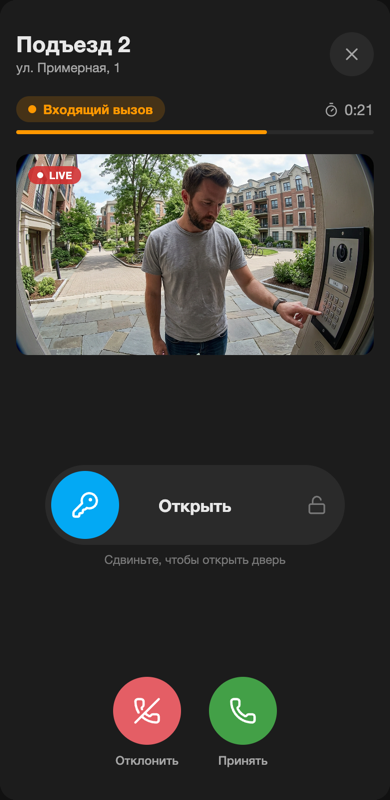
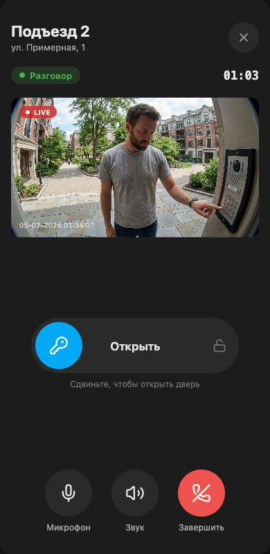
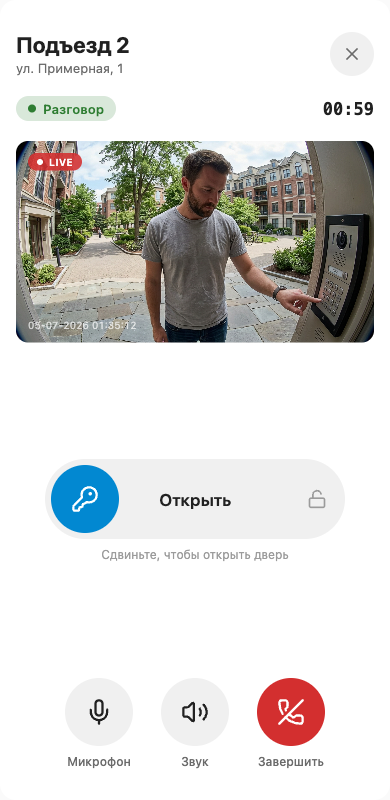
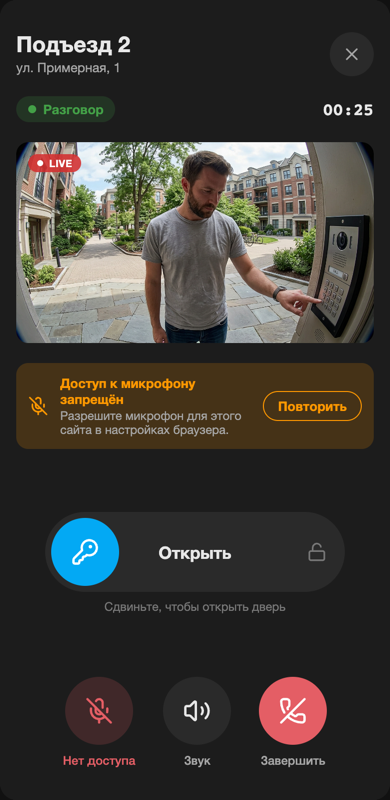
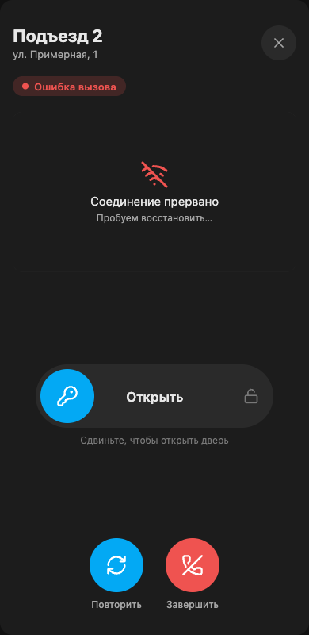
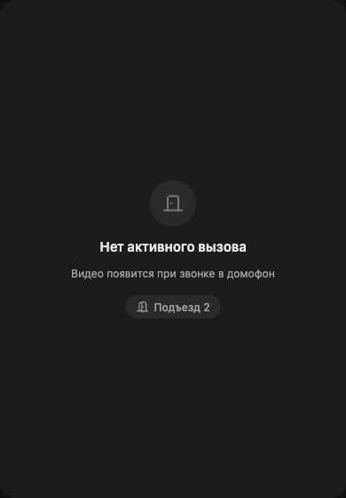
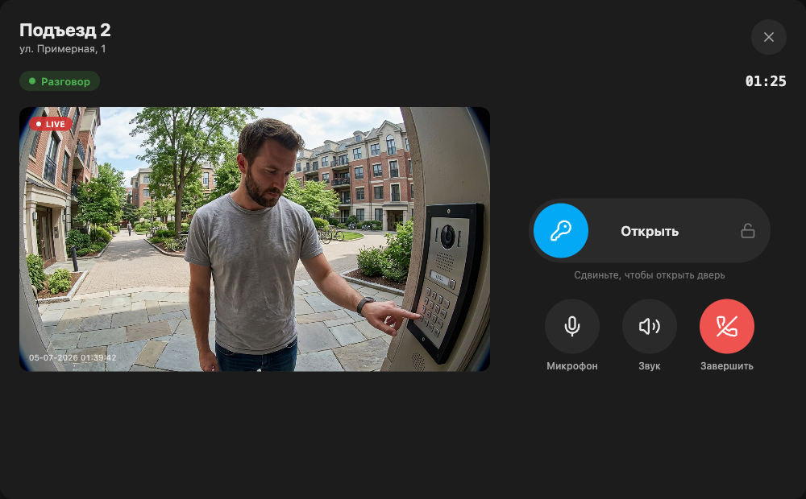
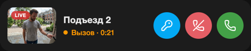
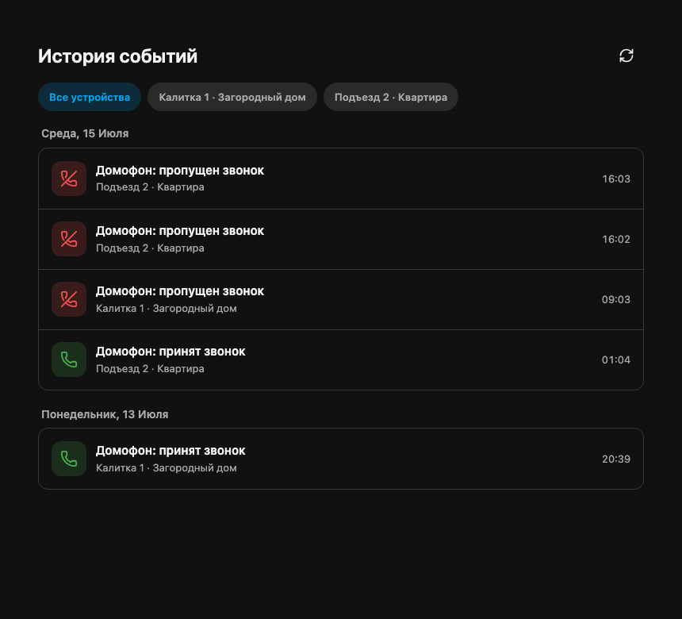

[English](/README.en_EN.md) | [Русский](/README.md)

<p>
  <a href="https://hacs.xyz"></a>
  
  
  
  
  
  
  
  
  <a href="https://boosty.to/gentslava"></a>
  <a href="https://yoomoney.ru/to/410011558436973"></a>
</p>

# Интеграция Home Assistant с Электронным Городом и Дом.ру

<table>
  <tr>
    <td align="center">
      <a href="https://2090000.ru/domofony/"></a>
    </td>
    <td align="center">
      <a href="https://play.google.com/store/apps/details?id=ru.inetra.intercom"></a>
    </td>
  </tr>
  <tr>
    <td align="center">
      <a href="https://dom.ru/domofon"></a>
    </td>
    <td align="center">
      <a href="https://play.google.com/store/apps/details?id=com.ertelecom.smarthome"></a>
    </td>
  </tr>
</table>

Ваши **домофоны, камеры и замки** Электронного города (Новотелеком) и Дом.ру —
прямо в Home Assistant. Гость позвонил в дверь — вы мгновенно видите видео,
слышите звук, отвечаете голосом и открываете дверь одним касанием, даже если
вы не дома.

Интеграция воспроизводит API официальных приложений «Мой Дом» и «Умный
Дом.ру»: смотрите камеры со звуком, принимайте и завершайте вызовы,
просматривайте историю принятых и пропущенных звонков и стройте на этом любые
автоматизации Home Assistant.

> 🎉 **Вышла 4.0.0** — крупнейшее обновление проекта: полноценный экран
> вызова, ответ и двусторонний звук по SIP, событие звонка в реальном времени
> (FCM), карточка истории и opt-in публикация камер через внешний RTSP.
> Краткий обзор — [ниже](#что-нового-в-400), полный список — в
> [release notes](docs/releases/4.0.0.md).

## Содержание

- [Установка](#установка)
- [Конфигурация](#конфигурация)
- [Что нового в 4.0.0](#что-нового-в-400)
- [Возможности](#возможности)
- [Подключение камер через go2rtc](#подключение-камер-через-go2rtc)
- [🔔 Событие звонка в домофон (FCM push)](#-событие-звонка-в-домофон-fcm-push)
- [📞 Двусторонний звук](#-двусторонний-звук-ответить-и-говорить)
- [🕘 История событий](#-история-событий)
- [Пример автоматизации: баланс](#пример-автоматизации-баланс)
- [Проблемы и вклад](#проблемы-и-вклад)
- [Лицензия](#лицензия)

## Что нового в 4.0.0

- **Вызов без polling:** входящий звонок приходит через FCM и сразу доступен
  автоматизациям Home Assistant.
- **Ответ и разговор:** SIP-приём, завершение вызова, видео и звук гостя,
  микрофон браузера и сервисы `elektronny_gorod.answer` / `hangup`.
- **Готовый экран вызова:** `custom:eg-intercom-call-card` объединяет видео,
  ответ, микрофон, звук и безопасное открытие двери; поддерживает телефон,
  desktop и настенную панель.
- **История событий:** `custom:eg-event-history-card` показывает принятые и
  пропущенные вызовы, группирует их по датам и устройствам и объединяет
  несколько мест или аккаунтов.
- **События для автоматизаций:** новые принятые и пропущенные вызовы появляются
  как HA `event` entities. История движения камеры доступна отдельной сущностью,
  отключённой по умолчанию; её включение запускает polling выбранной камеры.
- **Стабильный внешний RTSP:** включённые камеры можно отдельно опубликовать
  через go2rtc для NVR, медиаплеера или другой локальной системы. Публикация
  выключена по умолчанию; скрытые камеры подключаются отдельной настройкой.
- **Обновление без перенастройки:** повторно добавлять интеграцию в Home
  Assistant не требуется.
- **Надёжность:** исправлены FCM reconnect/watchdog, смена звонящего,
  конкурентное открытие call-video и lifecycle SIP/go2rtc.

Обновление не содержит breaking changes. Подробности, ограничения и инструкции
по обновлению собраны в [`docs/releases/4.0.0.md`](docs/releases/4.0.0.md).

## Установка

### Вручную

Скопируйте директорию `custom_components/elektronny_gorod` в директорию `config/custom_components` вашего Home Assistant.

```bash
git clone https://github.com/gentslava/elektronny-gorod.git
cp -r elektronny-gorod/custom_components/elektronny_gorod YOUR_HASS_CONFIG_DIR/custom_components/
```

Перезапустите Home Assistant.


### Через [HACS](https://hacs.xyz/)
<a href="https://my.home-assistant.io/redirect/hacs_repository/?owner=gentslava&repository=elektronny-gorod&category=integration" target="_blank"></a>

## Конфигурация
<a href="https://my.home-assistant.io/redirect/config_flow_start/?domain=elektronny_gorod" target="_blank"></a>

или вручную:

1. Перейдите в интерфейс Home Assistant.
2. Перейдите в Конфигурация -> Интеграции.
3. Нажмите кнопку "+" для добавления новой интеграции.
4. Найдите "Электронный город" и выберите его.
5. Следуйте инструкциям на экране для завершения настройки интеграции.

## Возможности

- Интеграция с сервисами Электронный Город и Дом.ру (работает с приложениями Мой Дом и Умный Дом.ру).
- Просмотр доступных договоров и добавление нужных в любом количестве.
- Запрос и ввод SMS-кода или пароля для аутентификации.
- Добавление доступных домофонов, камер и замков.
- Получение превью и потоков с домофонов и камер.
- Управление открытием замков в реальном времени.
- **Событие звонка в домофон в реальном времени** (FCM push) — `event`-сущность для уведомлений и автоматизаций (показать камеру, открыть дверь).
- **Двусторонний звук с домофоном** ⚠️ продвинутая фича — принять вызов (`answer`/`hangup`), видео+звук гостя одной карточкой и **разговор через микрофон браузера** (см. [раздел ниже](#-двусторонний-звук-ответить-и-говорить)).
- **История принятых и пропущенных вызовов** — отдельные сущности по местам и
  общая Lovelace-карточка с фильтрами и постраничной загрузкой.
- Состояние аккаунта: баланс, дни до блокировки и признак блокировки.
- Управление режимом «Не беспокоить» для домофонных и управляющих звонков.

Создаваемые типы сущностей: `camera` (обычное и активное call-video), `lock`
(открытие двери), `event` (вызовы и история), `sensor` (баланс,
дни до блокировки, состояние вызова), `binary_sensor` и `switch`.

> **go2rtc:** Интеграция может использовать уже работающий экземпляр
> [go2rtc](https://github.com/AlexxIT/go2rtc). Если его ещё нет, самый простой
> вариант — установить [WebRTC Camera](https://github.com/AlexxIT/WebRTC) через
> HACS: компонент сам загрузит и запустит go2rtc внутри Home Assistant.

## Подключение камер через go2rtc

Поддерживается интеграция с [go2rtc](https://github.com/AlexxIT/go2rtc) для камер Электронного города и Дом.ру. Этот способ позволяет:
- Получать аудиопоток с камер (звук).
- Получать более быстрый и стабильный видеопоток (низкая задержка, меньше обрывов).
- Опционально публиковать готовые потоки по стабильным RTSP-адресам для NVR,
  медиаплееров и других локальных клиентов.

### Как подключить

Интеграции нужен доступный экземпляр go2rtc с HTTP API и RTSP-портом. Добавлять
камеры из интеграции в `go2rtc.yaml` вручную не требуется: потоки создаются и
обновляются автоматически.

#### Если go2rtc уже установлен

Можно использовать существующий go2rtc — например, отдельный add-on, контейнер
или сервер в локальной сети:

1. Убедитесь, что Home Assistant видит HTTP API go2rtc (обычно
   `http://HOST:1984`) и RTSP-порт `8554`.
2. При добавлении интеграции выберите **«Настроить go2rtc»** и укажите URL API.
3. Если на go2rtc настроена Basic Auth, укажите имя пользователя и пароль в той
   же форме.

Для отдельного контейнера или сервера используйте его имя хоста либо локальный
IP-адрес, доступный из Home Assistant. Адрес `127.0.0.1` подходит только тогда,
когда go2rtc запущен в том же окружении, что и Home Assistant Core.

#### Если go2rtc ещё нет: WebRTC Camera через HACS

[WebRTC Camera](https://github.com/AlexxIT/WebRTC) автоматически загружает и
запускает собственный go2rtc, поэтому отдельный add-on или ручная установка
бинарного файла не нужны:

1. Откройте **HACS → Интеграции**, найдите **WebRTC** и установите компонент.
2. Перезапустите Home Assistant.
3. Откройте **Настройки → Устройства и службы → Добавить интеграцию → WebRTC**.
4. В настройках интеграции включите go2rtc и оставьте стандартный адрес
   `http://127.0.0.1:1984`.

Вместе с компонентом станет доступна Lovelace-карточка с низкой задержкой и
звуком:

```yaml
type: custom:webrtc-camera
entity: camera.YOUR_INTERCOM
```

Замените `camera.YOUR_INTERCOM` на идентификатор нужной камеры из Home
Assistant. При управлении ресурсами Lovelace через YAML выполните
[дополнительный шаг из документации WebRTC Camera](https://github.com/AlexxIT/WebRTC#installation).

#### Если интеграция уже настроена

Откройте её параметры и включите go2rtc — повторно добавлять учётную запись и
устройства не требуется.

**Примечание:** Для работы аудио и низкой задержки используйте актуальные версии
go2rtc, WebRTC Camera и Home Assistant.

### Внешний RTSP в 4.0.0

В настройках интеграции go2rtc появились две отдельные опции:

- **«Публиковать включённые камеры для внешнего RTSP»** — создаёт стабильные
  потоки только для включённых в Home Assistant сущностей камер.
- **«Также публиковать скрытые камеры»** — дополнительно включает скрытые
  сущности и работает только вместе с основной опцией. Отключённые сущности
  камер не публикуются никогда.

Обе опции по умолчанию выключены. Для опубликованных камер интеграция сразу
запускает фоновый go2rtc consumer: он не даёт одноразовой операторской ссылке
истечь до первого просмотра. Источник обновляется каждые 28 минут 30 секунд
без сброса уже подключённого зрителя. Готовые адреса и фактическое состояние
потоков отображаются диагностической сущностью **«Опубликованные RTSP-потоки»**;
учётные данные go2rtc в её атрибуты не попадают.

Настройка публикации влияет только на фоновый keep-warm. Явное открытие
включённой скрытой камеры в Home Assistant продолжает работать без постоянного
preload. Интеграция не открывает RTSP-порт в Интернет — сетевой доступ,
firewall, VPN и безопасность go2rtc остаются ответственностью пользователя.

## 🔔 Событие звонка в домофон (FCM push)

Интеграция получает **звонок в домофон в реальном времени** через FCM-push — так же, как мобильное приложение, без облачного опроса. На каждый домофон создаётся сущность `event` с классом устройства `doorbell`:

- **`event.<домофон>_doorbell_call`** — стреляет `ring` при входящем вызове и `ended` при завершении (приняли на другом устройстве или истёк таймаут ожидания).
- Атрибуты события: `event_type` (`ring`/`ended`), `gate_name` (домофон), `apartment` (квартира), `call_id`, `allow_open`, `reason`.

На этом строятся автоматизации: пуш с кадром камеры и кнопкой «Открыть дверь», показ видео, открытие замка.

> Канал — приватный FCM-приём (зависимость `firebase-messaging` ставится автоматически). Весь FCM-флоу под graceful degradation: при сбое остальная интеграция (камеры, замки, баланс) продолжает работать.
>
> В примерах замените `YOUR_INTERCOM` / `YOUR_PHONE` на свои сущности (Инструменты разработчика → Состояния, фильтры `event.` / `notify.mobile_app`). Кадр в пуше и кнопки действий работают через приложение **Home Assistant Companion** (Android/iOS).

### Пример 1. Пуш при звонке

```yaml
automation:
  - alias: "Домофон: уведомление о звонке"
    mode: parallel
    triggers:
      - trigger: state
        entity_id: event.YOUR_INTERCOM_doorbell_call
    conditions:
      - "{{ trigger.to_state.attributes.event_type == 'ring' }}"
    actions:
      - action: notify.mobile_app_YOUR_PHONE
        data:
          title: "🔔 Звонок в домофон"
          message: "{{ trigger.to_state.attributes.gate_name }} · кв. {{ trigger.to_state.attributes.apartment }}"
```

### Пример 2. Пуш с кадром камеры и кнопкой «Открыть дверь»

```yaml
automation:
  # 1) Уведомление с превью камеры и кнопкой действия
  - alias: "Домофон: пуш с камерой и открытием"
    mode: parallel
    triggers:
      - trigger: state
        entity_id: event.YOUR_INTERCOM_doorbell_call
    conditions:
      - "{{ trigger.to_state.attributes.event_type == 'ring' }}"
    actions:
      - action: notify.mobile_app_YOUR_PHONE
        data:
          title: "🔔 Звонок в домофон"
          message: "{{ trigger.to_state.attributes.gate_name }}"
          data:
            image: "/api/camera_proxy/camera.YOUR_INTERCOM"
            tag: "doorbell"
            actions:
              - action: "OPEN_DOOR"
                title: "🔓 Открыть дверь"

  # 2) Обработчик кнопки: открыть замок домофона
  - alias: "Домофон: открыть дверь по кнопке пуша"
    triggers:
      - trigger: event
        event_type: mobile_app_notification_action
        event_data:
          action: "OPEN_DOOR"
    actions:
      - action: lock.unlock
        target:
          entity_id: lock.YOUR_INTERCOM
```

## 📞 Двусторонний звук: ответить и говорить

> ⚠️ **Продвинутая фича.** Приём вызова домофона по SIP — поверх события звонка выше. Работает удалённо (4G) через авторизованный канал Home Assistant, без экспозиции go2rtc наружу.

Поверх FCM-события интеграция умеет **принять вызов и говорить с гостем у двери** — как в мобильном приложении:

- **Ответить / сбросить** — сервисы `elektronny_gorod.answer` и `elektronny_gorod.hangup` (из автоматизации или кнопкой в пуше).
- **Видео + звук гостя одной карточкой** — на время активного вызова появляется сущность `camera.<домофон>_intercom_call` (HA-native WebRTC: видео домофона + звук гостя, работает на 4G без экспозиции go2rtc). Вне вызова сущность недоступна — карточку прячьте `conditional`-карточкой.
- **Говорить (микрофон браузера → домофон)** — Lovelace-карта `custom:eg-intercom-mic-card` с кнопкой «🎤 Говорить». Микрофон едет в домофон по тому же авторизованному WebSocket Home Assistant — без go2rtc/TURN.

### Карточка экрана вызова

Готовая Lovelace-карта `custom:eg-intercom-call-card` — весь вызов одним экраном: видео гостя, «Открыть дверь» защищённым жестом, принять/завершить, микрофон. Ведётся по `sensor.<домофон>_call_state`, облик — на theme-токенах Home Assistant (тёмная/светлая), адаптив от телефона до настенной панели.

<table>
  <tr>
    <td align="center" width="33%"></td>
    <td align="center" width="33%"></td>
    <td align="center" width="33%"></td>
  </tr>
  <tr>
    <td align="center"><b>Входящий вызов</b><br/><sub>видео до принятия, окно ответа, slide-to-open</sub></td>
    <td align="center"><b>Разговор</b><br/><sub>LIVE, таймер, микрофон / звук / завершить</sub></td>
    <td align="center"><b>Светлая тема</b><br/><sub>из коробки, на токенах HA</sub></td>
  </tr>
</table>

<table>
  <tr>
    <td align="center" width="33%"></td>
    <td align="center" width="33%"></td>
    <td align="center" width="33%"></td>
  </tr>
  <tr>
    <td align="center"><b>Нет доступа к микрофону</b><br/><sub>баннер + «Разрешить»</sub></td>
    <td align="center"><b>Связь прервана</b><br/><sub>плейсхолдер + «Повторить»</sub></td>
    <td align="center"><b>Нет активного вызова</b><br/><sub>заглушка + точки доступа</sub></td>
  </tr>
</table>

<table>
  <tr>
    <td align="center"><br/><b>Настенная панель / десктоп</b> — 2 колонки: видео-герой + контролы (слайдер по центру, кнопки по нижней кромке)</td>
  </tr>
  <tr>
    <td align="center"><br/><b>Компактная карточка</b> (<code>layout: compact</code>) — одна строка: мини-превью + статус + быстрые кнопки</td>
  </tr>
</table>

> Установка карты — см. [`call-card-install.md`](docs/features/intercom-two-way-audio/call-card-install.md). UX-контракт и раскладки — [`call-card-ux-production.md`](docs/features/intercom-two-way-audio/call-card-ux-production.md).

### Карта микрофона

Карта раздаётся интеграцией статикой. Добавьте её как Lovelace-ресурс (**Настройки → Панели → ⋮ → Управление ресурсами → Добавить**, тип *JavaScript-модуль*):

```
/elektronny_gorod_static/eg-intercom-mic-card.js
```

Затем на дашборд вызова (под видео, при активном разговоре):

```yaml
type: custom:eg-intercom-mic-card
```

> Браузер отдаёт микрофон только на **HTTPS-origin** (или `localhost`). После добавления ресурса обновите страницу с очисткой кэша.

### Экран вызова и пуш-уведомления

Готовые blueprint-ы собирают **экран вызова** `/doorbell-call/call`: пуш будит телефон и одним тапом открывает в Home Assistant экран с видео, звуком гостя и кнопками «Ответить» / «Говорить» / «Открыть» / «Сбросить».

- `doorbell_call_notify` — пуш со снимком камеры + активная дверь (по разу на дверь);
- `doorbell_screen_controller` — SIP-состояние, «Открыть дверь» из пуша, сброс при старте (один на систему).

Пошаговая сборка (хелперы → blueprint-ы → дашборд → микрофон → pro-tip авто-звука) — в [`docs/features/intercom-two-way-audio/call-screen-setup.md`](docs/features/intercom-two-way-audio/call-screen-setup.md). Установка карты микрофона и ограничения — в [`docs/features/intercom-two-way-audio/uplink-card-install.md`](docs/features/intercom-two-way-audio/uplink-card-install.md).

## 🕘 История событий

Просматривайте принятые и пропущенные вызовы в отдельной карточке Home
Assistant и используйте новые вызовы в автоматизациях.

<p align="center">
  
</p>

Карточка истории входит в тот же файл, что и экран вызова. Добавьте ресурс один
раз:

```text
/elektronny_gorod_static/eg-intercom-call-card.js
```

Затем укажите сущность истории нужного места:

```yaml
type: custom:eg-event-history-card
entity: event.account_123456_place_7890_event_history
title: События
```

Для нескольких мест или настроенных аккаунтов используйте `entities:` —
карточка объединит ленты по времени и сохранит раздельные фильтры устройств.
Тексты оператора и персональные данные в карточке не показываются.

Подробная настройка и ограничения:
[`history-card.md`](docs/features/mobile-app-parity/history-card.md).

## Пример автоматизации: баланс
Вот пример автоматизации для уведомления о низком балансе:

```yaml
automation:
  - alias: "Уведомление о низком балансе"
    trigger:
      - platform: numeric_state
        entity_id: sensor.elektronny_gorod_balance
        below: 100
    action:
      - service: notify.notify
        data:
          message: "Баланс вашего счета в Электронном городе ниже 100 рублей."
```

## Проблемы и вклад

Если вы столкнулись с проблемами или у вас есть предложения по улучшению, пожалуйста, [откройте issue](https://github.com/gentslava/elektronny-gorod/issues) на GitHub.

Не стесняйтесь вносить вклад в проект, форкнув репозиторий и создавая pull-запросы.

## Благодарности

❤️ **Спасибо всем донатерам**, поддержавшим интеграцию рублём — ваша поддержка мотивирует развивать проект дальше.

Поддержать разработку: [](https://boosty.to/gentslava) [](https://yoomoney.ru/to/410011558436973)

Типы устройств Apple https://gist.github.com/adamawolf/3048717

[go2rtc](https://github.com/AlexxIT/go2rtc) — проект для работы с потоковым видео и аудио

## Лицензия

Эта интеграция лицензирована под лицензией MIT. См. файл [LICENSE](LICENSE) для подробностей.
